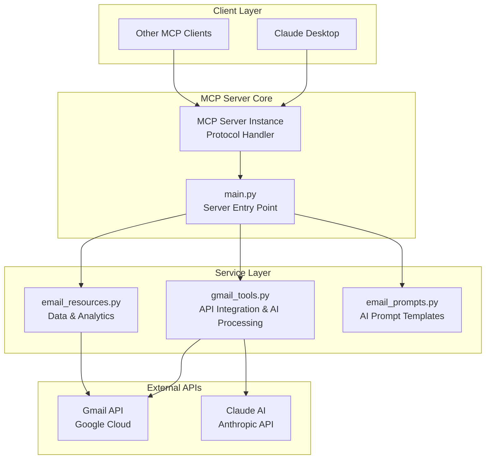
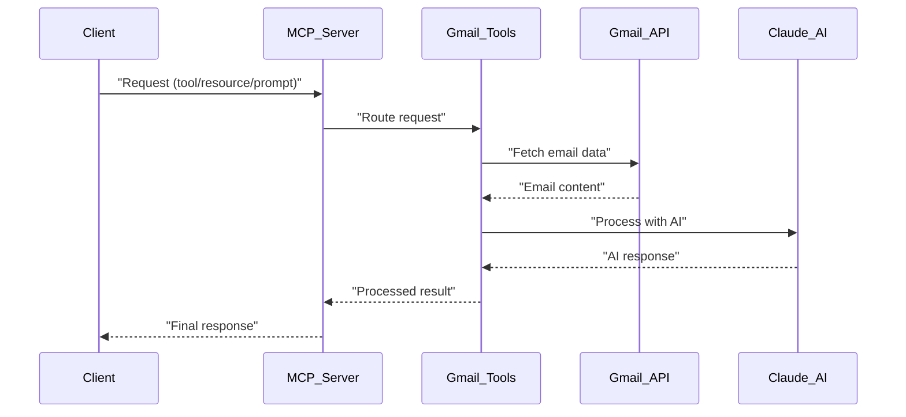

# Gmail MCP Server: Architecture & Business Overview

## Executive Summary

The Gmail MCP Server is a sophisticated AI-powered email management system that leverages the Model Context Protocol (MCP) to provide intelligent email operations through Large Language Model integration. It serves as a bridge between Gmail's API and AI capabilities, enabling automated email categorization, intelligent response generation, and comprehensive email analytics.

## 🏗️ System Architecture

### Core Components Overview

> **Note**: The following Mermaid diagrams require a Mermaid extension (such as "Markdown Preview Mermaid Support" by Matt Bierner) to render properly in VS Code markdown preview.[^1]



### 1. **Main Server (`main.py`)**
- **Purpose**: Central orchestration hub implementing the MCP protocol
- **Key Responsibilities**:
  - Environment validation and configuration management
  - MCP protocol handler registration (tools, resources, prompts)
  - Request routing and error handling
  - Logging and monitoring infrastructure
- **Configuration Management**: Environment-driven configuration with validation
- **Security**: Validates required credentials and enforces secure practices

### 2. **Tools Layer (`gmail_tools.py`)**
- **Purpose**: Gmail API integration with AI-enhanced functionality
- **Core Capabilities**:
  - **Email Operations**: List, fetch, send, modify emails
  - **AI Processing**: Email categorization, response generation, summarization
  - **Smart Filtering**: Query-based email retrieval with intelligent search
  - **Flagged Email Management**: Specialized handling of starred/important emails
- **AI Integration**: Claude API for natural language processing
- **Error Handling**: Comprehensive error management with graceful degradation

### 3. **Resources Layer (`email_resources.py`)**
- **Purpose**: Read-only data access and analytics
- **Data Sources**:
  - Real-time email summaries (daily, weekly, unread)
  - Email templates and signatures
  - Analytics and trend data
  - Contact frequency analysis
- **Use Cases**: Dashboard data, reporting, trend analysis

### 4. **Prompts Layer (`email_prompts.py`)**
- **Purpose**: Standardized AI prompt templates for consistent responses
- **Prompt Categories**:
  - Email categorization with business logic
  - Response generation with tone control
  - Multi-email summarization
  - Action item extraction
  - Sentiment analysis
  - Follow-up drafting

## 📚 Background

### LLM Temperature

**Temperature** is a critical parameter that controls the **randomness** and **creativity** of AI model responses. Understanding and properly configuring temperature is essential for building reliable AI-powered applications like our Gmail MCP Server.

#### What is Temperature?

Temperature affects how the AI model selects the next word/token when generating text:

- **Range**: Typically 0.0 to 2.0 (sometimes higher)
- **Scale**: Lower = more deterministic, Higher = more creative/random

When an AI model generates text, it calculates probabilities for possible next words:

```
Example word probabilities:
"important" → 60%
"urgent"    → 25% 
"critical"  → 10%
"vital"     → 5%
```

**Temperature modifies these probabilities:**

#### Temperature Settings Explained

| Temperature | Behavior | Use Case | Example Result |
|-------------|----------|----------|----------------|
| **0.0** | Completely deterministic | Data analysis, factual tasks | Always picks "important" |
| **0.1-0.3** | Very consistent, minimal variation | Email categorization, code generation | "important" 85% of time, "urgent" occasionally |
| **0.4-0.6** | Balanced consistency | Email summarization, professional responses | Natural variation while staying on-topic |
| **0.7-1.0** | Creative but controlled | Response generation, content creation | Good balance of consistency and creativity |
| **1.2-2.0** | High creativity/randomness | Creative writing, brainstorming | Might pick unexpected words like "vital" |

#### Why Temperature = 0.3 for Email Categorization?

In our Gmail MCP Server, we use `temperature=0.3` for email categorization because **consistency is critical**:

**Business Logic Requirements:**
1. **Reliable Classifications**: Same email type should always get the same category
2. **User Trust**: Predictable behavior builds confidence in the system
3. **Workflow Integration**: Downstream processes depend on consistent categories
4. **Audit Trail**: Repeatable results for compliance and debugging

**Example with Email Categorization:**

*Email Subject*: "Invoice #12345 - Payment Due"

- **With Temperature = 0.3 (Consistent)**: 
  - "Receipts" (95% of the time)
  - "Work" (5% of the time)
  - Users can rely on categorization

- **With Temperature = 1.0 (Variable)**:
  - Results vary: "Receipts", "Work", "Urgent", "Personal"
  - Same email might get different categories
  - Breaks user expectations and workflows

#### Temperature Strategy by Use Case

Our MCP Server uses temperature strategically across different operations:

| Operation | Temperature | Reasoning |
|-----------|-------------|-----------|
| **Email Categorization** | 0.3 | Need consistent, reliable classifications |
| **Response Generation** | 0.7 | Want natural language but appropriate tone |
| **Email Summarization** | 0.4 | Balanced summaries that aren't too rigid |
| **Action Item Extraction** | 0.2 | Prefer factual, consistent interpretations |

#### Implementation Example

```python
# Temperature configuration via environment variables
class GmailTools:
    def __init__(self):
        # Temperature settings for different use cases (configurable via environment)
        self.temp_categorization = float(os.getenv('CLAUDE_TEMP_CATEGORIZATION', '0.3'))
        self.temp_response_generation = float(os.getenv('CLAUDE_TEMP_RESPONSE_GENERATION', '0.7'))
        self.temp_summarization = float(os.getenv('CLAUDE_TEMP_SUMMARIZATION', '0.4'))
        self.temp_action_extraction = float(os.getenv('CLAUDE_TEMP_ACTION_EXTRACTION', '0.2'))

# Email categorization with configurable temperature
async def categorize_emails(self, email_ids, categories=None):
    response = await self.claude_client.messages.create(
        model=self.model,
        temperature=self.temp_categorization,  # Configurable via CLAUDE_TEMP_CATEGORIZATION
        max_tokens=self.max_tokens,
        messages=[{"role": "user", "content": prompt}]
    )
```

#### Environment Variables

The temperature settings are now configurable via environment variables, allowing for easy tuning without code changes:

| Environment Variable | Default | Purpose |
|---------------------|---------|---------|
| `CLAUDE_TEMP_CATEGORIZATION` | 0.3 | Email categorization consistency |
| `CLAUDE_TEMP_RESPONSE_GENERATION` | 0.7 | Natural response generation |
| `CLAUDE_TEMP_SUMMARIZATION` | 0.4 | Balanced email summarization |
| `CLAUDE_TEMP_ACTION_EXTRACTION` | 0.2 | Precise action item identification |
| `CLAUDE_TEMPERATURE` | 0.7 | Legacy fallback temperature |

This strategic use of temperature ensures our Gmail MCP Server provides:
- **Predictable categorization** that users can trust
- **Consistent behavior** for business process integration
- **Reliable results** that support automated workflows
- **Debuggable outcomes** when troubleshooting is needed

## 🔄 Workflow Architecture

### Email Processing Pipeline

> **Note**: This sequence diagram also requires a Mermaid extension to render in VS Code.[^1]



### Key Workflows

#### 1. **Email Categorization Workflow**
1. **Input**: Email IDs and optional custom categories
2. **Process**: 
   - Fetch email content from Gmail API
   - Extract headers, subject, body, and metadata
   - Generate AI categorization prompt with business context
   - Process through Claude with temperature=0.3 for consistency
   - Validate and normalize category responses
3. **Output**: Structured categorization with confidence levels

#### 2. **Smart Response Generation Workflow**
1. **Input**: Email ID, response tone, custom instructions
2. **Process**:
   - Retrieve original email content and context
   - Apply tone-specific prompt templates (formal, casual, brief, detailed)
   - Generate contextually appropriate response via Claude
   - Include proper email threading and subject handling
3. **Output**: Professional response draft ready for review/sending

#### 3. **Flagged Email Management Workflow**
1. **Input**: Date range and result limits
2. **Process**:
   - Query Gmail for starred emails within timeframe
   - Extract metadata and content for each email
   - Apply specialized AI summarization focusing on urgency and action items
   - Generate prioritized action lists
3. **Output**: Prioritized summary with actionable insights

## 🛠️ Technical Implementation Details

### Authentication & Security
- **OAuth 2.0 Flow**: Secure Gmail API access with minimal required scopes
- **Token Management**: Automatic refresh with secure local storage
- **API Key Security**: Environment-based configuration, never hardcoded
- **Error Boundaries**: Comprehensive error handling with graceful degradation

### AI Integration Architecture
- **Model Selection**: Claude Haiku (default) for speed/cost optimization
- **Prompt Engineering**: Specialized prompts for different business contexts
- **Temperature Control**: Varied by use case (0.3 for categorization, 0.7 for responses)
- **Token Management**: Configurable limits with content truncation

### Data Management
- **No Persistent Storage**: Privacy-focused design with no email content caching
- **Real-time Processing**: All operations work directly with Gmail API
- **Batch Processing**: Optimized batch operations for multiple emails
- **Rate Limiting**: Respects Gmail API quotas with intelligent batching

### Performance Optimization
- **Async Operations**: Full async/await pattern for scalability
- **Connection Pooling**: Efficient API connection management
- **Content Truncation**: Intelligent content limiting for AI processing
- **Caching Strategy**: Minimal caching for performance without compromising security

## 🔧 Operational Capabilities

### Tools (Actions) - 9 Available

| Tool | Business Purpose | AI Enhancement |
|------|------------------|----------------|
| `list_emails` | Email discovery and filtering | Smart query interpretation |
| `categorize_emails` | Automated email organization | AI-powered classification |
| `generate_response` | Intelligent response drafting | Context-aware content generation |
| `send_email` | Email delivery with threading | Proper threading and formatting |
| `summarize_emails` | Multi-email analysis | Structured insight extraction |
| `list_flagged_emails` | Important email identification | Date-range filtering |
| `summarize_flagged_emails` | Critical email analysis | Priority-focused summarization |
| `flag_emails` | Email importance marking | Batch flagging operations |
| `unflag_emails` | Email importance removal | Efficient batch processing |

### Resources (Data Access) - 8 Available

| Resource | Business Value | Update Frequency |
|----------|----------------|------------------|
| Today's Summary | Daily email overview | Real-time |
| Weekly Summary | Trend analysis | Daily refresh |
| Unread Summary | Priority identification | Real-time |
| Response Templates | Consistency & efficiency | Static/configurable |
| Email Signatures | Professional branding | Static/configurable |
| Category Statistics | Performance metrics | Real-time calculation |
| Email Trends | Behavioral insights | Periodic analysis |
| Frequent Contacts | Relationship mapping | Dynamic analysis |

### Prompts (AI Templates) - 8 Available

| Prompt | Business Application | Consistency Benefit |
|--------|---------------------|-------------------|
| `categorize_email` | Standard email classification | Uniform categorization |
| `generate_response` | Professional response crafting | Tone consistency |
| `summarize_emails` | Meeting preparation & catch-up | Structured insights |
| `extract_action_items` | Task identification | Nothing missed |
| `draft_follow_up` | Professional follow-up | Relationship management |
| `analyze_sentiment` | Communication assessment | Risk identification |
| `summarize_flagged_emails` | Priority email analysis | Focus on urgency |
| `prioritize_flagged_emails` | Critical task management | Workload optimization |

## 🎯 Business Value Proposition

### Productivity Gains
1. **Email Processing Speed**: 10x faster email categorization and response
2. **Decision Support**: AI-powered prioritization of important emails
3. **Context Preservation**: Intelligent summarization maintains critical details
4. **Workflow Automation**: Reduced manual email management overhead

### Quality Improvements
1. **Consistent Communication**: Standardized response quality and tone
2. **Reduced Errors**: AI validation of content and context
3. **Professional Standards**: Template-driven communication consistency
4. **Comprehensive Coverage**: Nothing falls through the cracks

### Strategic Benefits
1. **Scalability**: Handle increasing email volumes without proportional resource increases
2. **Analytics**: Data-driven insights into communication patterns
3. **Integration**: Seamless integration with existing workflows via MCP
4. **Future-Proof**: Extensible architecture for additional AI capabilities

## 🚀 Areas for Improvement & Enhancement

### 1. **Reliability & Error Handling**

#### Current Gaps:
- Limited retry mechanisms for API failures
- Basic error recovery for partial batch operations
- Minimal circuit breaker patterns for external API dependencies

#### Recommended Improvements:
- **Implement Exponential Backoff**: Add retry logic with exponential backoff for transient failures
- **Circuit Breaker Pattern**: Implement circuit breakers for Gmail and Anthropic APIs
- **Graceful Degradation**: Fallback mechanisms when AI services are unavailable
- **Health Checks**: Regular health monitoring of external dependencies

```python
# Example implementation
async def robust_api_call(self, operation, *args, **kwargs):
    """Implement robust API calling with retries and circuit breaker"""
    for attempt in range(self.max_retries):
        try:
            if self.circuit_breaker.is_open():
                raise CircuitBreakerError("API circuit breaker is open")
            return await operation(*args, **kwargs)
        except TransientError as e:
            await asyncio.sleep(self.backoff_delay * (2 ** attempt))
        except Exception as e:
            self.circuit_breaker.record_failure()
            raise
```

### 2. **Performance Optimization**

#### Current Opportunities:
- Sequential processing of batch operations
- No intelligent caching strategy
- Suboptimal content extraction for large emails

#### Recommended Enhancements:
- **Parallel Processing**: Implement concurrent processing for batch email operations
- **Intelligent Caching**: Cache email metadata and AI responses with TTL
- **Content Optimization**: Smart content extraction and summarization for large emails
- **Connection Pooling**: Optimize API connection management

```python
# Example parallel processing
async def process_emails_parallel(self, email_ids: List[str], max_concurrency=5):
    """Process multiple emails concurrently with controlled concurrency"""
    semaphore = asyncio.Semaphore(max_concurrency)
    
    async def process_single_email(email_id):
        async with semaphore:
            return await self.process_email(email_id)
    
    tasks = [process_single_email(email_id) for email_id in email_ids]
    return await asyncio.gather(*tasks, return_exceptions=True)
```

### 3. **Enhanced AI Capabilities**

#### Current Limitations:
- Single model dependency (Claude only)
- Fixed prompt templates
- Limited context learning

#### Advanced Features:
- **Multi-Model Support**: Add support for multiple AI providers (OpenAI, local models)
- **Adaptive Prompts**: Dynamic prompt optimization based on user feedback
- **Context Learning**: Remember user preferences and communication patterns
- **Advanced Analytics**: Sentiment trends, communication effectiveness metrics

```python
# Example multi-model support
class AIProviderManager:
    def __init__(self):
        self.providers = {
            'claude': ClaudeProvider(),
            'openai': OpenAIProvider(),
            'local': LocalModelProvider()
        }
    
    async def categorize_email(self, content, provider='claude'):
        """Route to appropriate AI provider with fallback"""
        primary = self.providers.get(provider)
        if not primary or not primary.is_available():
            # Fallback to available provider
            for backup in self.providers.values():
                if backup.is_available():
                    return await backup.categorize(content)
```

### 4. **Security & Compliance**

#### Current Security Measures:
- OAuth token management
- Environment-based configuration
- No persistent email storage

#### Enhanced Security:
- **Audit Logging**: Comprehensive audit trail for compliance
- **Data Encryption**: Encrypt sensitive data in transit and at rest
- **Access Controls**: Role-based access to different MCP operations
- **Compliance Framework**: GDPR/SOX compliance features

```python
# Example audit logging
class AuditLogger:
    async def log_operation(self, user_id, operation, email_ids, result):
        """Log all operations for compliance and security"""
        audit_entry = {
            'timestamp': datetime.utcnow(),
            'user_id': user_id,
            'operation': operation,
            'email_count': len(email_ids),
            'success': result.get('success', False),
            'ip_address': self.get_client_ip(),
            'user_agent': self.get_user_agent()
        }
        await self.audit_store.record(audit_entry)
```

### 5. **Monitoring & Observability**

#### Current Monitoring:
- Basic logging infrastructure
- Error reporting in responses

#### Advanced Monitoring:
- **Metrics Collection**: Performance metrics, API usage, success rates
- **Real-time Dashboards**: Operational visibility and health monitoring
- **Alerting System**: Proactive issue detection and notification
- **Performance Analytics**: Usage patterns and optimization opportunities

```python
# Example metrics collection
class MetricsCollector:
    def __init__(self):
        self.metrics = {
            'api_calls': Counter(),
            'response_times': Histogram(),
            'error_rates': Counter(),
            'email_volumes': Gauge()
        }
    
    async def record_operation(self, operation, duration, success):
        """Record operation metrics for monitoring"""
        self.metrics['api_calls'][operation] += 1
        self.metrics['response_times'].observe(duration)
        if not success:
            self.metrics['error_rates'][operation] += 1
```

### 6. **User Experience Enhancements**

#### Current UX:
- Command-line configuration
- Basic error messages
- Limited customization options

#### Enhanced UX:
- **Configuration UI**: Web-based configuration interface
- **Rich Error Messages**: Detailed error context and resolution guidance
- **User Preferences**: Personalized settings and behavior customization
- **Interactive Setup**: Guided setup wizard for new users

### 7. **Scalability Improvements**

#### Current Architecture:
- Single-instance deployment
- In-memory state management
- Direct API coupling

#### Scalable Architecture:
- **Horizontal Scaling**: Support for multiple server instances
- **Queue Management**: Asynchronous job processing for large operations
- **Load Balancing**: Distribute load across multiple instances
- **Resource Management**: Dynamic resource allocation based on demand

## 📊 Success Metrics & KPIs

### Operational Metrics
- **Email Processing Speed**: Target <2 seconds per email categorization
- **AI Response Quality**: >90% user acceptance rate for generated responses
- **System Uptime**: 99.9% availability target
- **Error Rate**: <1% for all operations

### Business Metrics
- **Productivity Gain**: 50% reduction in email processing time
- **Response Consistency**: 95% of responses match organizational tone guidelines
- **User Adoption**: >80% of team actively using the system
- **ROI**: Positive ROI within 6 months of deployment

### Technical Metrics
- **API Latency**: <500ms for single email operations
- **Batch Processing**: Handle 100+ emails within 30 seconds
- **Memory Usage**: <512MB per server instance
- **CPU Utilization**: <70% average load

## 🎯 Implementation Roadmap

### Phase 1: Reliability (Weeks 1-4)
- Implement retry mechanisms and circuit breakers
- Add comprehensive error handling
- Create health monitoring system
- Establish audit logging

### Phase 2: Performance (Weeks 5-8)
- Implement parallel processing for batch operations
- Add intelligent caching layer
- Optimize content extraction algorithms
- Create performance monitoring dashboard

### Phase 3: Advanced Features (Weeks 9-16)
- Multi-model AI provider support
- Enhanced security and compliance features
- User preference learning system
- Advanced analytics and reporting

### Phase 4: Scale & Polish (Weeks 17-20)
- Horizontal scaling capabilities
- Configuration UI development
- Comprehensive documentation and training
- Performance optimization and tuning

## 💡 Conclusion

The Gmail MCP Server represents a sophisticated approach to AI-powered email management, demonstrating strong architectural foundations and clear business value. The system effectively bridges Gmail's API capabilities with advanced AI processing through the Model Context Protocol standard.

**Key Strengths:**
- Clean, modular architecture with clear separation of concerns
- Comprehensive AI integration with intelligent prompt engineering
- Strong security practices with OAuth and environment-based configuration
- Extensive functionality covering the full email management lifecycle

**Strategic Value:**
- Significant productivity gains through automation and AI assistance
- Improved communication quality and consistency
- Scalable foundation for future AI-powered office productivity tools
- Standards-based integration via MCP for broad compatibility

**Investment Priority:**
Focus initial improvements on reliability and performance enhancements, as these provide immediate business value and establish the foundation for more advanced features. The suggested phased approach ensures steady progress while maintaining system stability and user satisfaction.

This system positions your organization at the forefront of AI-powered productivity tools while maintaining the flexibility to evolve with advancing AI capabilities and changing business needs.

---

[^1]: **Mermaid Extension Required**: To view the diagrams in this document, install a Mermaid extension for VS Code such as "Markdown Preview Mermaid Support" by Matt Bierner or "Markdown All in One" by Yu Zhang. Without these extensions, the diagrams will appear as code blocks rather than rendered visuals.
